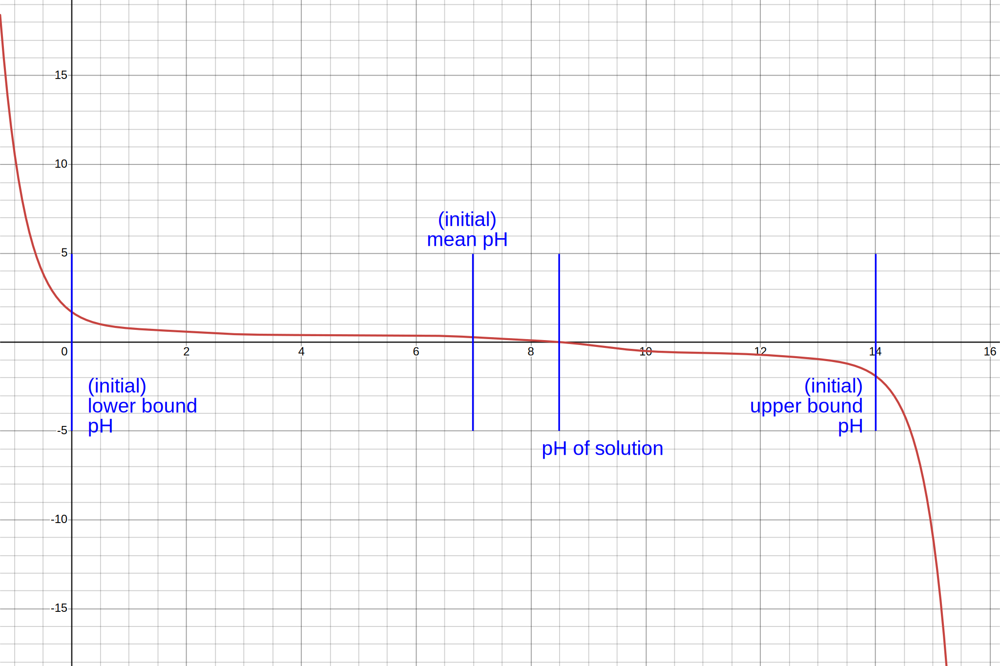

# pH_calc-core
A simple library crate that can calculate the pH of a solution, given the pKa and concentrations of species in that solution.

This library can also be called from Python with Python bindings available at [pH_calc-py](../pH_calc-py/).
## How it works
For a solution of e.g. oxalic acid in equilibrium:

$$H_2C_2O_4\rightleftharpoons HC_2O_4^{-}+H^{+}(K_{a1}=[H^{+}][HC_2O_4^{-}]/[H_2C_2O_4])(I)$$

$$HC_2O_4^{-}\rightleftharpoons H^{+}+C_2O_4^{2-}(K_{a2}=[H^{+}][C_2O_4^{2-}]/[HC_2O_4^{-}])\Rightarrow H_2C_2O_4\rightleftharpoons 2H^{+}+C_2O_4^{2-}(K_{a1}K_{a2})(II)$$

$$H_2O\rightleftharpoons H^{+}+OH^{-}(K_w=[H^{+}][OH^{-}])(III)$$

Conservation of initial concentration:

$$C^0_{H_2C_2O_4}=[H_2C_2O_4]_{undissociated}+[HC_2O_4^{-}]+[C_2O_4^{2-}]$$

$$\Rightarrow K_{a1}K_{a2}C^0_{H_2C_2O_4}=[H^{+}]^2[C_2O_4^{2-}]+\frac{[H^{+}]^2[HC_2O_4^{-}][C_2O_4^{2-}]}{[H_2C_2O_4]}+\frac{[H^{+}]^2[C_2O_4^{2-}]}{[H_2C_2O_4]}$$

$$=[C_2O_4^{2-}] ([H^{+}]^2+\frac{[H^{+}]^2[HC_2O_4^{-}]}{[H_2C_2O_4]}+\frac{[H^{+}]^2[C_2O_4^{2-}]}{[H_2C_2O_4]})$$

$$=[C_2O_4^{2-}] ([H^{+}]^2+[H^{+}]K_{a1}+K_{a1}K_{a2})$$

$$\Rightarrow[C_2O_4^{2-}]=C^0_{H_2C_2O_4}\frac{K_{a1}K_{a2}}{[H^{+}]^2+[H^{+}]K_{a1}+K_{a1}K_{a2}}(IV)$$

Similarly,

$$[HC_2O_4^{-}]=C^0_{H_2C_2O_4}\frac{[H^{+}]K_{a1}}{[H^{+}]^2+[H^{+}]K_{a1}+K_{a1}K_{a2}}(V)$$

and

$$[H_2C_2O_4]=C^0_{H_2C_2O_4}\frac{[H^{+}]^2}{[H^{+}]^2+[H^{+}]K_{a1}+K_{a1}K_{a2}}(VI)$$

Similarly, for a base such as ammonia:

$$NH_3+H^{+}\rightleftharpoons NH_4^{+}(K_a^{-1})$$
$$[NH_4^{+}]=C^0_{NH_3}\frac{[H^{+}]}{[H^{+}]+K_{a(NH_4^{+})}}$$

$$[NH_3]=C^0_{NH_3}\frac{K_{a(NH_4^{+})}}{[H^{+}]+K_{a(NH_4^{+})}}$$

Or for a triprotic acid like phosphoric acid:

$$[H_2PO_4^{-}]=C^0_{H_3PO_4}\frac{[H^{+}]^2K_{a1}}{[H^{+}]^3+[H^{+}]^2K_{a1}+[H^+]K_{a1}K_{a2}+K_{a1}K_{a2}K_{a3}}$$

$$[HPO_4^{2-}]=C^0_{H_3PO_4}\frac{[H^+]K_{a1}K_{a2}}{[H^{+}]^3+[H^{+}]^2K_{a1}+[H^+]K_{a1}K_{a2}+K_{a1}K_{a2}K_{a3}}$$

$$[PO_4^{3-}]=C^0_{H_3PO_4}\frac{K_{a1}K_{a2}K_{a3}}{[H^{+}]^3+[H^{+}]^2K_{a1}+[H^+]K_{a1}K_{a2}+K_{a1}K_{a2}K_{a3}}$$

Conservation of charge:

$$(I)(II)(III)\Rightarrow[H^{+}]=[OH^{-}]+[HC_2O_4^{-}]+2[C_2O_4^{2-}] (VII)$$

$$(IV)(V)(VI)(VII)\Rightarrow [H^{+}] \Rightarrow pH$$

(for bases e.g. ammonia):

$$[H^{+}]=[OH^{-}]-[NH_4^{+}]...$$

The plot of 

$$LHS-RHS=y=[H^+]-([OH^{-}]+[HC_2O_4^{-}]+2[C_2O_4^{2-}]); x=10^{-[H^{+}]}$$ 

will (be very likely to) have a shape similar to the following plot (personally, I have not found any exceptions yet):



The similarity is that it is a decreasing plot, with the red line crossing the x-axis at exactly 1 point (which is consistent with reality, as a solution with defined concentrations of acids and bases has only 1 value of pH) where $RHS=LHS$ and $x=pH$.

This program solves for pH by first calculating $LHS-RHS$ at the lower and upper bound pH (both are first set to the minimum and maximum pH value that can exist in the solvent, respectively), and the mean pH (which is the mean of the lower and upper bound pH values).

If the y-value of the mean pH has the same sign as that of the lower bound pH, the lower bound pH value is set to the mean pH, while the new mean is calculated from the new lower bound and upper bound values, and vice versa. This process repeats 1000 times, and the output is the final mean pH, which is very close to the actual pH of the solution.
## Usage
```rust 
pub fn compute_pH(solution: &[AcidBase], properties: &SolProperties) -> f64 
```
Where:
- `solution`: Species in a solution
    - `AcidBase`: comprises the following properties:
        ```rust
        is_acid: bool, // Whether it is an acid or a base
        conc: f64, // Concentration
        dissoc_consts_acid: Vec<f64> // Ka of the acid/conjugate acid of the base
        ```
        To instantiate new acids and bases, use the constructor:
        ```rust
        pub fn new(is_acidic: bool, conc: f64, mut pKa_values: Vec<f64>) -> Self
        ```
- `properties`: Properties of the solvent, consisting of:
    - `pKi`: Self-ionization constant of the solvent (which is `14` for water)
    - `min_pH` and `max_pH` are the minimum and maximum possible pH values that can exist in that solvent, respectively

    In case the solvent is water, there is a shorthand constructor `SolProperties::water()`, with `pKi` set to `14`, `min_pH` set to `-2.0`, and `max_pH` set to `16.0`
    
    Otherwise, you can always use 
    ```rust
    SolProperties::new(pKi: f64, min_pH: f64, max_pH: f64)
    ```

Returns:
- The pH value of the solution

Example code snippet:
```rust
// Calculate pH of 0.1M phosphoric acid in water
compute_pH(&[
        AcidBase::new(
            true,
            0.1,
            &mut [2.12, 7.21, 12.67]
        )
    ], &SolProperties::water())
// Should output: ~1.62
```
For amphoteric species, treat them as separate acids and bases.
## To-Do's
- Include the activity of ions and volume in calculations
- Include automatic detection of amphoteric species